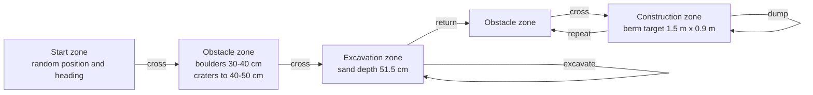
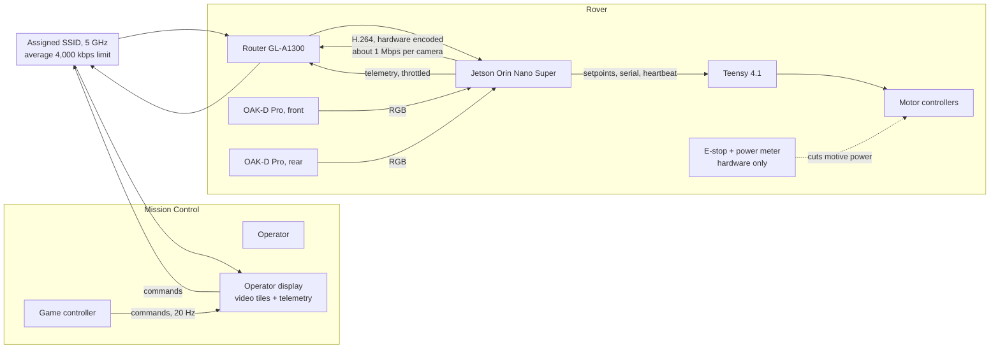
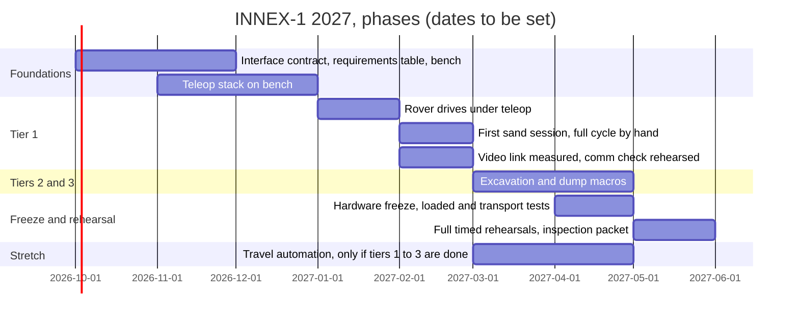

# INNEX-1 for UK Lunabotics 2027: concept of operations, first pass

Status: draft for discussion. Level: system. No implementation detail.

Source rulebook: UK Lunabotics RuleBook 2026 v1.0. Treat every number below as provisional until the 2027 rulebook is published.

## 1. What we start with

| Item | State | Note |
|---|---|---|
| Rover (chassis, drivetrain, bucket ladder, deposition) | Built, competed June 2026 | Mechanical model not yet received. Aluminium motor mounts planned to replace the 3D-printed mounts that failed. |
| Compute | Jetson Orin Nano Super Developer Kit | 8 GB shared RAM. JetPack 6, Ubuntu 22.04. |
| Depth cameras | 2 x Luxonis OAK-D Pro | RGB + active stereo depth + IMU. |
| LiDAR | 1 x Ouster OS1-128 | High mass, power and data rate for this rover. See section 6. |
| Motor control | Teensy 4.1, Sabertooth 2x32 (drive), Cytron MDD10A, 57BLR50 BLDC (excavation), linear actuators | Pin map and serial protocol from June 2026 exist in the old repo. |
| Power | 6S LiPo (motive), 4S LiPo (compute) | Dual domain. Compute battery stays live through E-stop. This is permitted by E-STOP rule 4. |
| Radio | GL-A1300 router | 5 GHz preferred. 2.4 GHz off by default in RoboPits. |
| Team | Two people | One software lead, one electrical engineer moving to software. |
| Software | `innex1-rover` repo, ROS 2 Humble | Reference library. Not the base for 2027. |

## 2. The mission in one picture

Arena: about 7.9 m x 4.4 m. Run: 20 minutes. Setup: 10 minutes. Removal: 5 minutes. If the rover does not move within 5 minutes of the timer start, the run ends. If the rover stops moving for 5 minutes, the run ends.

## 3. Where the points are

Scores from both runs add. The example sheet in the rulebook (an experienced US team, 66 kg, 36 Wh, 77,551 cm3 of berm) totals 695 points for one run:

| Element | Example points | What drives it |
|---|---|---|
| Berm productivity, normalised for mass | 344.6 | Berm volume per minute per kilogram of rover |
| Berm productivity, normalised for energy | 215.4 | Berm volume per minute per watt-hour consumed |
| Bandwidth (arena cameras used) | 60 (1 camera) | 0 cameras = 120, 1 = 60, 2 = 0 |
| Autonomy | 75 (excavation) | 75 / 50 / 250 / 450 / 600 tiers |

Three conclusions follow.

1. Berm construction is about 80% of a good run. Cycles per run, sand per cycle, rover mass and energy use decide the result. Autonomy does not.
2. Zero arena cameras is worth 120 points per run, 240 over the event. It needs only a reliable onboard video link. This is the cheapest large score on the sheet.
3. Excavation automation (75) and dump automation (50) are mechanism sequences. They do not need a map or localisation across the arena. Travel automation (250) does.

The rulebook also warns: "the teams shall not architect a point-and-traverse approach" for travel automation, and the walls may not be used for sensing. Travel automation is a real perception and planning problem, not a scripted drive.

## 4. Target score

Proposed target, in order of priority. Each tier is a gate. We do not start work on a tier until the tier before it is demonstrated on the rover in sand.

| Tier | Capability | Points per run | Points per event | Depends on |
|---|---|---|---|---|
| 0 | Pass vehicle inspection and comm check | Permission to run | - | E-stop, power meter wiring, radio config, datasheets |
| 1 | Teleop mission. 3 or more excavate-dump cycles in 20 minutes. Zero arena cameras. | Berm points + 120 | Berm points + 240 | Drivetrain, mechanisms, video link, operator training, energy budget |
| 2 | Excavation automation | +75 | +150 | Mechanism sensors (current, position, limit), a state machine, a hands-free trigger |
| 3 | Dump automation | +50 | +100 | Same as tier 2, plus construction-zone alignment |
| 4 | Travel automation, first exit from start zone | +250 | +500 | Localisation without walls, obstacle detection, planning, sand testing |
| 5+ | Full autonomy | Replaces 2 to 4 | - | Not in scope for 2027 planning |

Tiers 0 and 1 are the plan. Tiers 2 and 3 are the target. Tier 4 is the stretch. This inverts 2026, where most of the software effort went to tier 4 and none of tiers 1 to 3 ran on hardware.

Mass and energy are score multipliers. Every component on the rover must justify its mass and its watt-hours against berm volume. This includes sensors and compute.

## 5. Teleoperation concept

### 5.1 Principle

The operator drives with video and telemetry from the rover only. Nothing else is allowed by the rules once we choose zero arena cameras. The teleop system is therefore a safety-relevant system, not a convenience.

### 5.2 Data flow

### 5.3 Rules the teleop design must satisfy

- Average bandwidth is limited to 4,000 kbps. Two hardware-encoded H.264 streams at about 1 Mbps each leave headroom for telemetry and command traffic.
- Transmit only on the assigned SSID. Set 2.4 GHz channel width to 20 MHz. No power amplifiers.
- The comm check takes at most 15 minutes. We must show wireless control, disable 2.4 GHz on request, and produce datasheets for any non-Wi-Fi radio.
- The E-stop cuts motive power in hardware. Software does not participate in the E-stop path.
- The rover must move within 5 minutes of the timer start. The startup sequence from power-on to first drive command must be rehearsed and timed.

### 5.4 Fail-safe behaviour

- If the Jetson receives no command for 500 ms, the Jetson commands zero velocity.
- If the Teensy receives no heartbeat for 250 ms, the Teensy commands zero to every motor controller.
- If the operator loses video, the operator releases the controls. Motion stops by the rule above.
- After an E-stop, motion does not resume on reset. The operator sends an explicit enable command.

These numbers are starting points for the interface contract. They carry over from the 2026 fail-closed design, which passed inspection.

### 5.5 Operator workload

One operator drives. One operator watches telemetry, the clock, and talks to the Mission Control judge. The two roles are the two team members. Every autonomy attempt must be announced before it starts. Failure must be announced before manual control resumes. The second seat owns those announcements.

## 6. Sensor and compute allocation

| Sensor | Teleop (tiers 1 to 3) | Travel automation (tier 4) | Cost |
|---|---|---|---|
| OAK-D Pro, front | RGB for driving. Depth unused. | Depth for obstacle detection. IMU for odometry. | Low mass. About 4.5 W each. |
| OAK-D Pro, rear | RGB for reversing and dump alignment. | Depth for reverse travel. | Low mass. About 4.5 W each. |
| Ouster OS1-128 | Not used. Powered off. | 360-degree obstacle map. LiDAR odometry candidate. | About 14 to 20 W. High data rate. Heavy for its value on this rover. |
| Wheel encoders | Odometry display. Slip detection. | Odometry input. | Nil. |
| Motor current | Stall and load display. | Excavation progress signal. | Nil. |

The Ouster question needs an honest answer. It gives no points until tier 4. It costs energy on every run, which lowers the energy-normalised berm score. Its 128-channel output loads an 8 GB Jetson that also encodes two video streams. Two US teams in the reference list use a light Livox LiDAR for this job. The recommendation is to keep the Ouster off the rover for tiers 1 to 3, and to decide in spring whether tier 4 is realistic. If tier 4 goes ahead, run the Ouster in a reduced mode (fewer channels or lower rate) and measure the Jetson load before committing.

Fiducials are allowed on the arena frame near the start zone. Every US team in section 9 uses AprilTag or ArUco markers there for a global position fix. Tier 4, if attempted, should follow the same pattern: fiducial fix at the start, IMU plus wheel odometry between fixes, depth camera or LiDAR for obstacles.

## 7. Turning, and the shuttle question

A random start heading (north, east, south or west) means the rover will turn at least once at the start of most runs. A no-turn design cannot avoid that turn. It can avoid every other one.

Turning costs energy and time in sand. Skid-steer turns dig the wheels in and load the motor mounts. A bidirectional rover, with a camera at each end and a drive that is symmetric front to back, excavates at one end of the arena and dumps at the other without turning. That is the natural shuttle for this arena, with or without autonomy.

Whether the rover can excavate facing one way and dump facing the other depends on the mechanical layout, which we have not seen. Two options:

- Option A: bucket ladder and deposition on opposite ends. Shuttle with no turns after the start. Two cameras, one per end. Simplest to drive.
- Option B: bucket ladder and deposition on the same end. One 180-degree turn per half cycle. Two cameras still useful. More energy, more mount load, more operator work.

Decision needed with the mechanical team once the model arrives. Software should not assume either option yet. The drive interface must support driving in both directions with the same controls, so the operator does not swap left and right when the rover reverses.

## 8. Constraints and risks

### 8.1 Hard constraints from the rulebook

- Envelope 150 x 75 x 75 cm at inspection. Mass at most 80 kg.
- Four marked lifting points. One carrier per 20 kg.
- One unmodified red COTS E-stop, at least 40 mm, highest practical point, latching, single push disconnects batteries from all controllers and active subsystems. A separate battery for the control computer is allowed outside the E-stop path.
- Power meter between the battery and the E-stop. Readings must survive an E-stop. 30-point penalty on the energy score if wired otherwise.
- No GPS, no compass, no ultrasonic sensors, no touch sensors, no pneumatic tyres, no foam, no hydraulics.
- No wall sensing for autonomy. No process that changes the sand.
- Only the assigned SSID. 4,000 kbps average. 2.4 GHz at 20 MHz. No power amplifiers. Class 1 Bluetooth and Zigbee prohibited.
- Autonomy attempts must be announced. Hands free means nobody touches any equipment in Mission Control.

### 8.2 Programme risks

| Risk | Likelihood | Effect | Mitigation |
|---|---|---|---|
| Mechanical model and rover access arrive late | High | Software cannot test on hardware | Build a bench (Teensy, one Sabertooth, one motor, E-stop) now. Define the interface contract from the June 2026 pin map. |
| Two-person team, one in third year | Certain | Limited hours. Single points of failure. | Scope to tiers 0 to 3. Write runbooks so either person can operate alone. |
| Load-bearing parts fail under sand load or transport (2026 failure mode) | Medium | Run ends | Loaded sand test before design freeze. Transport test before competition. Owned by the mechanical team; dates on the shared calendar. |
| Video link fails or exceeds 4,000 kbps | Medium | Blind operator, or comm-check failure | Hardware encoding, measured bitrate, rate limit at the router, rehearsed comm check. |
| Jetson overloaded by sensors plus video plus ROS | Medium | Latency, dropped frames, watchdog trips | Ouster off for teleop. Measure CPU, GPU and memory with every added node. |
| 2027 rulebook changes a constraint | Medium | Rework | Keep a one-page requirements table with a rulebook clause reference for each row. Re-check on publication. |
| Autonomy work starts before teleop is proven | High, by habit | Repeat of 2026 | Tier gates in section 4. No tier 4 work until tier 1 is demonstrated in sand. |
| Development environment blocks work (2026 pattern) | Medium | Lost weeks | Jetson for hardware code. VM or shared Linux box for the rest. Bag replay on macOS with Foxglove. |

### 8.3 Technical risks specific to this rover

- Skid steer in 20 to 50 cm of sand: slip, sinkage, wheel odometry unreliable. Affects tier 4 more than teleop.
- The bucket ladder and the drive must not run at the same time (2026 electrical rule). The control software must enforce this, or the electrical design must remove the constraint.
- Dust on camera lenses. Any cleaning method must be one that would work on the Moon.
- Battery logistics: attended charging, upright storage, no overnight charging. Two runs on two days need a charging plan.

## 9. What other teams do

Public repositories from the US competition, checked September 2026. Patterns, not prescriptions.

| Team | Compute | Sensors | Teleop video | Autonomy | Notes |
|---|---|---|---|---|---|
| University of Minnesota (GOFIRST) | Jetson AGX Orin | ZED stereo | GStreamer NVENC AV1 over Wi-Fi to an RQT frontend | Isaac ROS nvblox costmap, Nav2 | VESC motor controllers on CAN. Arduino for limit switches. ROS 2 Humble. Runs Trufflehog for secrets in CI. |
| College of DuPage | x86 | Livox LiDAR, cameras | PyQt5 GUI | Point-LIO, RTAB-Map, Nav2 action servers | Humble and Jazzy. Third-party packages vendored. |
| Embry-Riddle (RAER) | x86 | Livox, RealSense, IMU | Not stated | FAST-LIO, robot_localization | Humble, 22.04. |
| Utah | x86, Rust | 3 USB cameras | H.264 RTP over UDP, hardware encoded, egui viewer | AprilTags for global pose, EKF | Cameras hot-plug by USB port. Camera failure detected at 500 ms without frames. |
| WPI | Not stated | RealSense, wheel odometry | Not stated | Nested ArUco markers plus wheel odometry, A* | Bucket ladder, 0.015 m3/min. |

Common threads:

- Video leaves the rover as a hardware-encoded H.264, H.265 or AV1 stream over UDP or RTP, outside ROS. Nobody streams raw ROS images over Wi-Fi.
- A fiducial (AprilTag or ArUco) at the start zone gives the global fix. Everything else is relative.
- A microcontroller owns limit switches and low-level I/O. The main computer talks to it over one serial or CAN link.
- Bucket ladders dominate excavation. Every recent winner has used one.
- Teams with a LiDAR chose a light one (Livox) and a LiDAR-inertial odometry package. Nobody in this list runs a 128-channel spinning unit on a small Jetson.

## 10. Phase plan, first cut

Each phase ends with a demonstration on the rover and a recorded bag. A phase that is not demonstrated is not complete.

## 11. Decisions needed

1. Mechanical layout: same-end or opposite-end excavation and deposition. Needs the model.
2. Ouster on or off the rover for tiers 1 to 3. Recommendation: off.
3. Target mass for the 2027 rover. The score divides by it.
4. Who operates the rover on which days, given a third-year timetable.
5. Development machines: Jetson plus VM only, or a shared Linux box.
6. Confirm the E-stop and power meter wiring against the rulebook, with a diagram, before any electrical change.

## 12. Open questions for the organisers

- Publication date of the 2027 rulebook.
- Moon Yard and Mission Control network details still marked TBD in v1.0.
- Whether a fiducial on the arena frame counts as "using the wall" if the fiducial is the only external reference.
- Whether energy consumed by an independent compute battery is included in the energy score.
